# 🌿 EventHub — TCS iON Smart Event Booking System

[](./LICENSE)
[](https://nodejs.org)
[](https://react.dev)
[](https://mongodb.com)
[](https://github.com/am6nath)

> A full-stack MERN event booking platform built for the TCS iON internship program.  
> Features a role-based multi-user system, event approval workflow, atomic seat management, a dual-mode image upload system, a post-event rating/review engine, and a rich analytics dashboard — all wrapped in a custom "Forest & Paper" design system.

---

## 📑 Table of Contents

1. [Project Overview](#-project-overview)
2. [Live Demo & Credentials](#-live-demo--test-credentials)
3. [Tech Stack](#-tech-stack)
4. [Features](#-features)
5. [System Architecture](#-system-architecture)
6. [Database Schema](#-database-schema)
7. [API Reference](#-api-reference)
8. [Project Structure](#-project-structure)
9. [Design System](#-design-system)
10. [Getting Started](#-getting-started)
11. [Environment Variables](#-environment-variables)
12. [Security Implementation](#-security-implementation)
13. [Known Limitations](#-known-limitations)

---

## 🎯 Project Overview

EventHub is a production-ready event booking web application built on the MERN stack. It serves three distinct user roles — **Admin**, **Organizer**, and **User** — each with a dedicated dashboard and controlled access to platform features.

### Core Concept

| Role | Primary Responsibility |
|---|---|
| **Admin** | Platform governance: approve/reject events, manage all users, view real-time analytics |
| **Organizer** | Event lifecycle: create, edit, and monitor their own events and attendees |
| **User** | Discovery & booking: browse events, book tickets, cancel bookings, review attended events |

---

## 🔑 Live Demo & Test Credentials

Start the backend and frontend (see [Getting Started](#-getting-started)), then use these pre-registered accounts to explore the different dashboards:

| Role | Email | Password |
|---|---|---|
| **Admin** | `admin@tcs.com` | `admin123` |
| **Organizer** | `org@tcs.com` | `org123` |
| **User** | `user@tcs.com` | `user123` |

---

## 🛠️ Tech Stack

### Backend
| Technology | Version | Purpose |
|---|---|---|
| Node.js | 18+ | JavaScript runtime |
| Express.js | ^4.18 | REST API framework |
| MongoDB | 6+ | NoSQL database |
| Mongoose | ^8.0 | ODM & schema validation |
| JSON Web Token | ^9.0 | Stateless authentication |
| bcryptjs | ^2.4 | Password hashing |
| Multer | ^2.1 | File/image upload |
| express-validator | ^7.0 | Input validation & sanitisation |
| express-rate-limit | ^7.0 | API abuse prevention |
| Helmet | ^8.1 | HTTP security headers |
| compression | ^1.8 | Response payload compression |
| dotenv | ^16.0 | Environment variable management |
| nodemon | ^3.0 | Dev auto-restart |

### Frontend
| Technology | Version | Purpose |
|---|---|---|
| React | ^19.2 | UI library |
| React Router DOM | ^7.14 | Client-side routing |
| Vite | ^8.0 | Build tool & dev server |
| Tailwind CSS | ^3.4 | Utility-first styling |
| Framer Motion | ^12.38 | Page & micro-animations |
| Axios | ^1.15 | HTTP client with interceptors |
| Recharts | ^3.8 | Admin analytics charts |
| lucide-react | ^0.383 | Icon library |
| react-hot-toast | ^2.6 | Toast notifications |

---

## ✨ Features

### 🔐 Authentication & Authorization
- JWT-based authentication with a **7-day expiry**
- Passwords hashed with **bcrypt** (10 salt rounds)
- Auto-login after registration for frictionless UX
- **Token expiry interceptor** — automatic redirect to `/login` on 401
- Role-based route guards: `ProtectedRoute` (role-aware) + `RequireAuth` (auth-only)
- Smart root redirect sends each role to their primary workspace on login

### 🎪 Event Management
- **Approval Workflow**: Organizer-submitted events go to `pending` → Admin approves/rejects with a reason
- **Edit Request Workflow**: Organizers must request admin permission to edit an already-approved event
- **8 Categories**: conference, workshop, concert, sports, networking, webinar, festival, other
- Rich filters: search, location, category, date range, price range, minimum rating
- Full-text MongoDB index on title, description, and location
- Admin-created events are auto-approved and go live immediately

### 🎫 Booking System
- **Atomic seat decrement** using `findOneAndUpdate` with `$gte` guard (prevents overselling)
- **Unique ticket IDs** auto-generated: `TKT-{user4}-{event4}-{timestamp36}{random3}`
- **Group bookings**: 1–10 tickets per booking
- **Duplicate booking prevention** via compound unique index `(userId, eventId)`
- **24-hour cancellation policy**: bookings cannot be cancelled within 24 hours of the event
- Price snapshot stored at time of booking (`priceAtBooking`) for accurate historical records

### ⭐ Review & Rating System
- Users can review an event only after it has passed and they have a confirmed booking
- Each review covers both the **event** (1–5 stars + comment) and the **organizer** (1–5 stars + comment)
- **Upsert strategy**: re-submitting updates the existing review (no duplicates)
- Organizer's `avgRating` and `reviewCount` are **automatically recalculated** and stored on the User document after every review via a post-save aggregation hook
- Reviews paginated with `page` and `limit` query params

### 👑 Admin Dashboard
- Real-time KPI cards: total users, organizers, events, bookings, and **total revenue (₹)**
- **Recharts** visualisations:
  - Monthly Traffic vs Sales (line chart)
  - Bookings by Category (pie chart)
- Full user management: create, edit (name/email/password/role), delete (with cascade)
- Full event management: approve/reject with rejection reason, delete
- Full booking management: paginated table with search
- Edit-request approval: approve or reject organizer's request to modify an approved event

### 🗂️ Organizer Dashboard
- View all own events with live stats: booked seats, revenue, occupancy rate, edit-request status
- Attendee list per event (name + email of confirmed bookings)
- Submit update requests for approved events

### 👤 User Dashboard
- Upcoming bookings at a glance
- Quick actions: browse events, view all bookings

### 🖼️ Dual-Mode Image Upload
- **URL mode**: Paste any public image URL
- **File upload mode**: Upload JPG, PNG, WebP, or AVIF files up to **5 MB** via Multer
- Uploaded files served as static assets from `backend/public/uploads/`

### 🎨 UI/UX
- **"Forest & Paper" design system** — earthy greens (`forest-*`) on warm off-white (`paper-*`) with dark ink tones (`ink-*`)
- Google Fonts: **Bodoni Moda** (headings), **DM Sans** (body), **DM Mono** (ticket IDs)
- Smooth **page transitions** via Framer Motion `AnimatePresence`
- **Scroll-to-top** on every route change
- Fully **responsive** — mobile hamburger menu with animated drawer
- **Loading skeletons** and spinners for async states
- Animated active underline in the Navbar using Framer Motion `layoutId`

---

## 🏗️ System Architecture

```
┌─────────────────────────────────────────────────────────────────┐
│                        CLIENT (React + Vite)                     │
│                                                                   │
│  AuthContext ──► Axios Interceptor ──► API Services              │
│       │                                    │                      │
│  ProtectedRoute                    eventApi / bookingApi /        │
│  RequireAuth                       adminApi / authApi             │
│       │                                    │                      │
│  Pages: Home, EventList, EventDetail,      │                      │
│         Booking, MyBookings, Dashboards    │                      │
└─────────────────────────────────┬──────────┘                      │
                                  │ HTTPS / JSON                    │
┌─────────────────────────────────▼──────────────────────────────┐
│                     SERVER (Express.js)                          │
│                                                                  │
│  Middleware Stack:                                               │
│  Helmet → Compression → CORS → RateLimit → express.json         │
│                │                                                 │
│         Route Handlers                                           │
│  /api/auth    → authRoutes    → authController                   │
│  /api/events  → eventRoutes   → eventController                  │
│  /api/bookings→ bookingRoutes → bookingController                │
│  /api/admin   → adminRoutes   → adminController                  │
│  /api/organizers→organizerRoutes→organizerController             │
│  /api/reviews → reviewRoutes  → reviewController                 │
│  /api/upload  → uploadRoutes  (Multer)                           │
│                │                                                 │
│         Middleware:                                              │
│  verifyToken (JWT) → optionalAuth → authorize (RBAC)            │
└─────────────────────────────────┬──────────────────────────────┘
                                  │ Mongoose ODM
┌─────────────────────────────────▼──────────────────────────────┐
│                       MongoDB                                    │
│                                                                  │
│   Users ◄──── Events ◄──── Bookings                             │
│      ▲              ▲                                            │
│      └──── Reviews ─┘                                           │
└─────────────────────────────────────────────────────────────────┘
```

---

## 🗃️ Database Schema

### User
```
name        String   required, trim, max:50
email       String   required, unique, lowercase, regex validated
password    String   required, min:6, bcrypt hashed (pre-save)
role        String   enum:[user, organizer, admin], default:user
avgRating   Number   0–5, auto-updated after each review
reviewCount Number   auto-updated after each review
createdAt   Date     auto (timestamps)
```

### Event
```
title            String   required, max:100
description      String   required, max:1000
date             Date     required
location         String   required
category         String   enum:[conference,workshop,concert,sports,networking,webinar,festival,other]
ticketPrice      Number   default:0 (free)
totalSeats       Number   required, min:1
availableSeats   Number   required, min:0
organizerId      ObjectId ref:User, required
imageUrl         String   optional
status           String   enum:[draft,pending,approved,rejected,cancelled,completed]
editRequestStatus String  enum:[none,pending,approved]
rejectionReason  String   max:500
```
**Indexes**: `(date,location)`, `(status,organizerId)`, `(category,status)`, full-text on `(title,description,location)`  
**Virtuals**: `isSoldOut`, `isUpcoming`

### Booking
```
userId         ObjectId  ref:User, required
eventId        ObjectId  ref:Event, required
ticketId       String    required, unique, uppercase
quantity       Number    1–10, default:1
status         String    enum:[confirmed,cancelled]
bookedAt       Date      default:now
priceAtBooking Number    snapshot of ticketPrice at booking time
```
**Indexes**: `(userId,eventId)` unique, `(userId,bookedAt)`, `(eventId,status)`  
**Virtuals**: `totalPrice`, `isActive`

### Review
```
userId           ObjectId  ref:User, required
eventId          ObjectId  ref:Event, required
organizerId      ObjectId  ref:User (organizer), required
eventRating      Number    1–5, required
eventComment     String    max:500
organizerRating  Number    1–5, required
organizerComment String    max:500
```
**Indexes**: `(userId,eventId)` unique, `(organizerId,createdAt)`, `(eventId,createdAt)`  
**Post-save hook**: Recalculates and updates `User.avgRating` and `User.reviewCount` for the organizer

---

## 📡 API Reference

All routes are prefixed with `/api`. Protected routes require:  
`Authorization: Bearer <JWT_TOKEN>`

### Auth `/api/auth`
| Method | Endpoint | Access | Description |
|--------|----------|--------|-------------|
| POST | `/register` | Public | Register (returns JWT + auto-login) |
| POST | `/login` | Public | Login (returns JWT) |
| GET | `/profile` | Protected | Get current user profile |
| PUT | `/profile` | Protected | Update name / email |
| PUT | `/change-password` | Protected | Change password |

### Events `/api/events`
| Method | Endpoint | Access | Description |
|--------|----------|--------|-------------|
| GET | `/` | Public | List approved events (filters: search, location, category, date, price, rating) |
| GET | `/organizer/my` | Organizer/Admin | Get organizer's own events with stats |
| GET | `/:id` | Public | Get single event details + review stats |
| GET | `/:id/stats` | Organizer/Admin | Get event booking statistics |
| POST | `/` | Organizer/Admin | Create event (pending approval) |
| PUT | `/:id` | Organizer/Admin | Update event |
| POST | `/:id/request-update` | Organizer | Request permission to edit approved event |
| DELETE | `/:id` | Organizer/Admin | Delete event + cascade bookings & reviews |

### Bookings `/api/bookings`
| Method | Endpoint | Access | Description |
|--------|----------|--------|-------------|
| POST | `/` | User/Organizer/Admin | Book an event (with atomic seat check) |
| GET | `/my` | All authenticated | Get current user's bookings |
| GET | `/:id` | Owner/Admin | Get single booking |
| GET | `/event/:eventId` | Organizer/Admin | Get all bookings for an event |
| PUT | `/:id/cancel` | Owner/Admin | Cancel booking (24hr policy, restores seats) |

### Admin `/api/admin`
| Method | Endpoint | Access | Description |
|--------|----------|--------|-------------|
| GET | `/dashboard` | Admin | Platform KPIs + chart data |
| GET | `/users` | Admin | All users (search, role, date filters, pagination) |
| POST | `/users` | Admin | Create user directly |
| PUT | `/users/:id` | Admin | Update user details |
| PUT | `/users/:id/role` | Admin | Change user role |
| DELETE | `/users/:id` | Admin | Delete user + all data (cascade) |
| GET | `/events` | Admin | All events (search, status, category filters) |
| PUT | `/events/:eventId/approve` | Admin | Approve / reject pending event |
| PUT | `/events/:eventId/approve-update` | Admin | Approve / reject organizer edit request |
| DELETE | `/events/:id` | Admin | Delete event + cascade bookings |
| GET | `/bookings` | Admin | All bookings (search, status, pagination) |

### Organizers `/api/organizers`
| Method | Endpoint | Access | Description |
|--------|----------|--------|-------------|
| GET | `/my/attendees` | Organizer/Admin | All confirmed attendees across organizer's events |
| GET | `/:id` | Public | Organizer public profile + stats + events |

### Reviews `/api/reviews`
| Method | Endpoint | Access | Description |
|--------|----------|--------|-------------|
| POST | `/:eventId` | User/Organizer/Admin | Submit review (requires past event + confirmed booking) |
| GET | `/event/:eventId` | Public | Get reviews for an event (paginated) |
| GET | `/check/:eventId` | Authenticated | Check if current user already reviewed event |
| GET | `/organizer/:organizerId` | Public | Get reviews for an organizer (paginated) |

### Upload `/api/upload`
| Method | Endpoint | Access | Description |
|--------|----------|--------|-------------|
| POST | `/` | Authenticated | Upload image file (max 5MB, jpg/png/webp/avif) |

### Health
| Method | Endpoint | Access | Description |
|--------|----------|--------|-------------|
| GET | `/api/health` | Public | Server health check |

---

## 📂 Project Structure

```
event-booking/
├── backend/
│   ├── .env                       # Environment variables
│   ├── package.json
│   ├── seed.js                    # Database seeder (test data)
│   ├── public/
│   │   └── uploads/               # Uploaded event images (served statically)
│   └── src/
│       ├── server.js              # App entry: middleware stack + route mounting
│       ├── config/
│       │   └── db.js              # MongoDB connection
│       ├── models/
│       │   ├── User.js            # User schema (bcrypt pre-save, matchPassword)
│       │   ├── Event.js           # Event schema (virtuals, indexes, statics)
│       │   ├── Booking.js         # Booking schema (atomic cancel, price snapshot)
│       │   └── Review.js          # Review schema (post-save rating aggregation)
│       ├── controllers/
│       │   ├── authController.js  # Register, login, profile CRUD, password change
│       │   ├── eventController.js # Event CRUD + stats + edit request workflow
│       │   ├── bookingController.js # Book, list, cancel (atomic + 24hr rule)
│       │   ├── adminController.js # Dashboard, user/event/booking management
│       │   ├── organizerController.js # Organizer profile + attendee list
│       │   └── reviewController.js # Submit, list, check reviews + aggregations
│       ├── routes/
│       │   ├── authRoutes.js      # Auth routes + express-validator rules
│       │   ├── eventRoutes.js     # Event routes (static before dynamic)
│       │   ├── bookingRoutes.js   # Booking routes
│       │   ├── adminRoutes.js     # Admin-only routes
│       │   ├── organizerRoutes.js # Organizer public/private routes
│       │   ├── reviewRoutes.js    # Review routes
│       │   └── uploadRoutes.js    # Multer file upload
│       ├── middleware/
│       │   ├── authMiddleware.js  # verifyToken, optionalAuth, authorize (RBAC)
│       │   ├── roleMiddleware.js  # Legacy role helper
│       │   └── errorMiddleware.js # 404 notFound + global errorHandler
│       └── utils/
│           ├── ticketGenerator.js # Unique ticket ID generator + validator
│           └── asyncWrapper.js    # Async error wrapper utility
│
└── frontend/
    ├── .env.local                 # VITE_API_BASE_URL
    ├── index.html                 # App shell (Google Fonts, meta tags)
    ├── vite.config.js
    ├── tailwind.config.js         # Forest & Paper design tokens
    ├── postcss.config.js
    └── src/
        ├── main.jsx               # React root: BrowserRouter + AuthProvider + Toaster
        ├── App.jsx                # Route tree + AnimatePresence + RootRedirect
        ├── index.css              # Global CSS vars, base resets, component classes
        ├── App.css
        ├── context/
        │   └── AuthContext.jsx    # Auth state, login/register/logout/refreshProfile
        ├── routes/
        │   └── ProtectedRoute.jsx # RequireAuth + ProtectedRoute (role-aware)
        ├── services/
        │   ├── axios.js           # Axios instance + JWT interceptor + 401 redirect
        │   ├── authApi.js         # Auth API calls
        │   ├── eventApi.js        # Event API calls
        │   ├── bookingApi.js      # Booking API calls
        │   ├── adminApi.js        # Admin API calls
        │   └── api.js             # Generic API helper
        ├── utils/
        │   ├── constants.js       # API base, ROLES, EVENT_STATUS, CATEGORIES, icons
        │   └── helpers.js         # Date formatting, currency, seat availability helpers
        ├── hooks/                 # Custom React hooks
        ├── components/
        │   ├── layout/
        │   │   ├── Navbar.jsx     # Responsive nav, role-aware dashboard link, dropdown
        │   │   └── Footer.jsx
        │   ├── ui/
        │   │   ├── Button.jsx     # Reusable button variants
        │   │   ├── Input.jsx      # Styled form input
        │   │   ├── Card.jsx       # Event card component
        │   │   ├── Badge.jsx      # Status badge
        │   │   ├── Loader.jsx     # Spinner / full-screen loader
        │   │   └── StarRating.jsx # Interactive & read-only star rating
        │   ├── events/            # Event-specific sub-components
        │   ├── bookings/          # Booking-specific sub-components
        │   └── dashboard/         # Dashboard-specific widgets
        └── pages/
            ├── Home.jsx           # Authenticated landing page
            ├── NotFound.jsx       # 404 page (Forest & Paper styled)
            ├── Unauthorized.jsx   # 403 page
            ├── Auth/
            │   ├── Login.jsx      # Login form with validation
            │   └── Register.jsx   # Register form (role selection)
            ├── Events/
            │   ├── EventList.jsx  # Paginated event discovery + filters
            │   ├── EventDetail.jsx# Full event details + reviews + book CTA
            │   ├── CreateEvent.jsx# Event creation form (dual-mode image upload)
            │   ├── EditEvent.jsx  # Event edit form
            │   └── Booking.jsx    # Booking confirmation page
            ├── Bookings/
            │   ├── MyBookings.jsx # User booking list with cancel
            │   └── BookingDetail.jsx # Individual booking + ticket display
            ├── Dashboard/
            │   ├── AdminDashboard.jsx    # Analytics + user/event/booking tables
            │   ├── OrganizerDashboard.jsx# Event management + attendee view
            │   └── UserDashboard.jsx     # Upcoming bookings + quick actions
            ├── Account/
            │   └── Profile.jsx    # Edit profile + change password
            └── Public/
                └── OrganizerProfile.jsx # Public organizer page + their events
```

---

## 🎨 Design System

The "Forest & Paper" design system uses a custom Tailwind configuration:

### Colour Palette

| Token | Value | Usage |
|---|---|---|
| `forest-50` … `forest-900` | Greens #f0f7ef → #1a3d17 | Brand, CTA, active states |
| `paper-50` … `paper-400` | Warm whites/greys #fafaf7 → #b5b3a4 | Backgrounds, borders |
| `ink-100` … `ink-900` | Warm greys #f0ede4 → #1a1714 | Text |

### Typography

| Font | Family | Usage |
|---|---|---|
| Serif | `Bodoni Moda` | Page headings, logo, premium labels |
| Sans | `DM Sans` | Body text, UI labels |
| Mono | `DM Mono` | Ticket IDs, code, data |

### Component Classes (defined in `index.css`)

```css
.btn-forest          /* Primary CTA button */
.btn-outline-forest  /* Secondary outlined button */
.card-paper          /* Paper-white elevated card */
.input-forest        /* Forest-themed form input */
.badge-status        /* Status chip */
```

---

## 🚀 Getting Started

### Prerequisites

- **Node.js** v18 or above
- **MongoDB** running locally on port `27017` (or update `MONGO_URI` in `.env`)
- **npm** v9+

### 1. Clone & Install

```bash
git clone <your-repo-url>
cd event-booking

# Install backend dependencies
cd backend
npm install

# Install frontend dependencies
cd ../frontend
npm install
```

### 2. Configure Environment

The backend `.env` is already pre-configured for local development:

```
# backend/.env
PORT=5000
NODE_ENV=development
MONGO_URI=mongodb://127.0.0.1:27017/event_booking_db
JWT_SECRET=tcs_ion_event_booking_secret_2026
JWT_EXPIRE=7d
UPLOAD_PATH=public/uploads
MAX_FILE_SIZE=5242880
```

The frontend `.env.local` is also pre-configured:
```
# frontend/.env.local
VITE_API_BASE_URL=http://localhost:5000/api
```

### 3. Create Upload Directory

```bash
mkdir backend/public/uploads
```

### 4. Seed the Database (Optional but Recommended)

```bash
cd backend
node seed.js
```

This creates the 3 test accounts and 6 sample events shown in [Test Credentials](#-live-demo--test-credentials).

### 5. Start the Application

**Terminal 1 — Backend:**
```bash
cd backend
npm run dev       # nodemon auto-restarts on changes
# Server: http://localhost:5000
```

**Terminal 2 — Frontend:**
```bash
cd frontend
npm run dev       # Vite HMR dev server
# App: http://localhost:5173
```

Open [http://localhost:5173](http://localhost:5173) in your browser.

---

## 🔐 Environment Variables

### Backend (`backend/.env`)

| Variable | Default | Description |
|---|---|---|
| `PORT` | `5000` | Express server port |
| `NODE_ENV` | `development` | App environment |
| `MONGO_URI` | `mongodb://127.0.0.1:27017/event_booking_db` | MongoDB connection string |
| `JWT_SECRET` | `tcs_ion_event_booking_secret_2026` | JWT signing secret (change in production!) |
| `JWT_EXPIRE` | `7d` | JWT token validity period |
| `UPLOAD_PATH` | `public/uploads` | Relative path for uploaded images |
| `MAX_FILE_SIZE` | `5242880` | Max upload size in bytes (5 MB) |

### Frontend (`frontend/.env.local`)

| Variable | Default | Description |
|---|---|---|
| `VITE_API_BASE_URL` | `http://localhost:5000/api` | Backend API base URL |

---

## 🛡️ Security Implementation

| Layer | Implementation |
|---|---|
| **Password Storage** | bcryptjs with 10 salt rounds |
| **Authentication** | JWT HS256, 7-day expiry, Bearer token |
| **Authorization** | Role-based middleware (`verifyToken` → `authorize(...roles)`) |
| **Rate Limiting** | 100 req/15 min global; **5 req/15 min** on `/auth/login` and `/auth/register` |
| **HTTP Headers** | Helmet.js (X-Frame-Options, Content-Security-Policy, etc.) |
| **Input Validation** | express-validator on all mutating endpoints |
| **Injection Prevention** | Mongoose ODM parameterised queries (no raw MongoDB strings) |
| **CORS** | Configured via `cors` middleware |
| **Token Expiry Handling** | Axios response interceptor auto-clears localStorage and redirects to `/login` on `401` |
| **Ownership Checks** | Controllers verify `userId === req.user.id` before allowing modifications |
| **Self-Deletion Guard** | Admin cannot delete or change their own role |

---

## ⚠️ Known Limitations

- **No email notifications**: Event approval/rejection is visible in the dashboard but no email is sent to the organizer.
- **Local file storage**: Uploaded images are stored on disk under `backend/public/uploads/`. For production, integrate an object storage service such as AWS S3 or Cloudinary.
- **In-memory search for bookings**: Admin booking search filters post-populate (after DB fetch), which is less efficient at scale. A production system would use MongoDB Atlas Search.
- **No payment gateway**: Ticket prices are tracked for analytics, but no actual payment processing is integrated.
- **`minRating` filter accuracy**: The rating filter is applied post-pagination, so the `total` count returned by the API may not exactly match the filtered result count.
- **Admin role self-registration**: The `admin` role can be selected during registration for academic/demo purposes. In production, admin creation should be restricted to `seed.js` only and removed from the public register route.
- **Debug route in production**: The `/api/test-jwt` route in `server.js` should be removed before deploying to production.

---

## 📸 Screenshots

> All screenshots captured from the live application. Run `node seed.js` in the `backend/` directory first to populate sample data.

---

### 🔐 Authentication

| Login | Register |
|:---:|:---:|
| 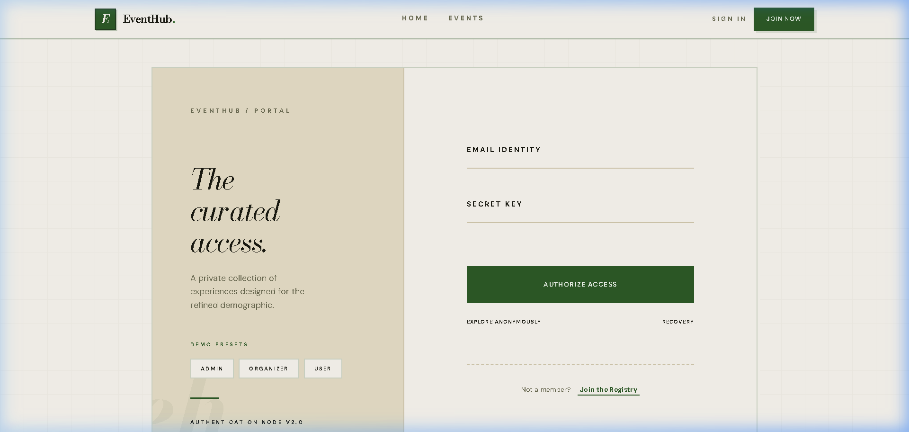 | 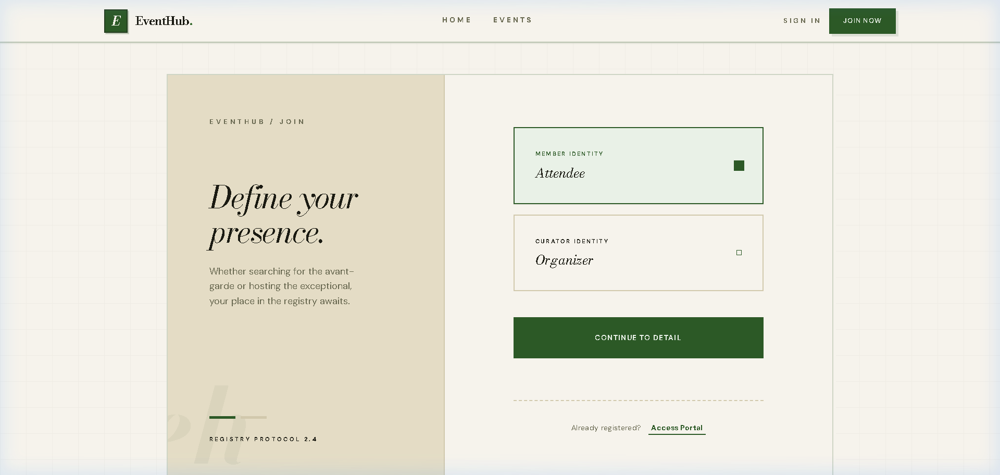 |
| JWT-based login with role-aware redirect | Role selection (User / Organizer / Admin) |

---

### 🏠 Home & Event Discovery

**Home Page — Authenticated Landing**
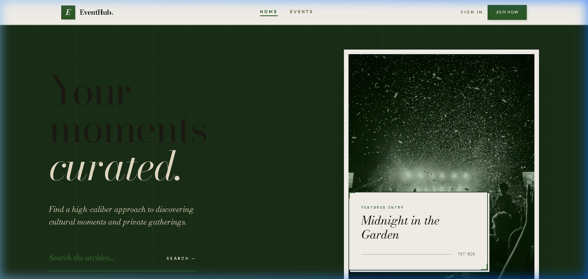

**Browse Events — Filterable Grid**
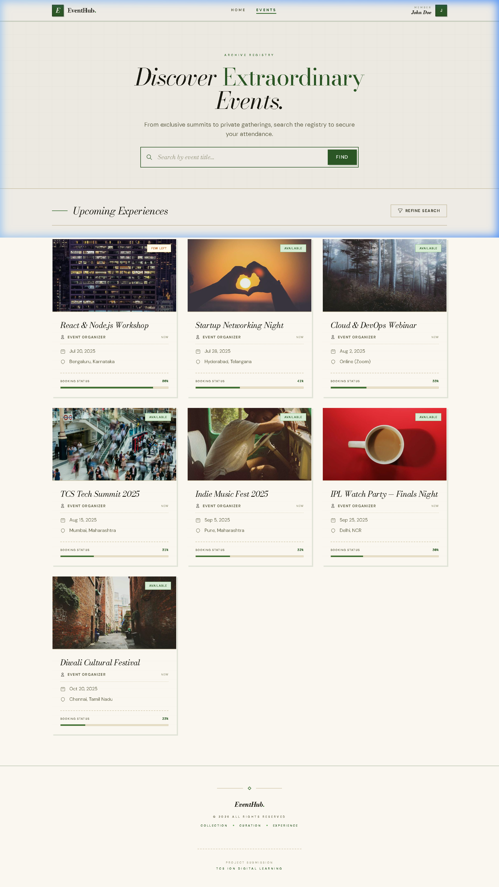
> Paginated event cards with search, category, location, date-range, price & rating filters.

**Event Detail + Reviews**
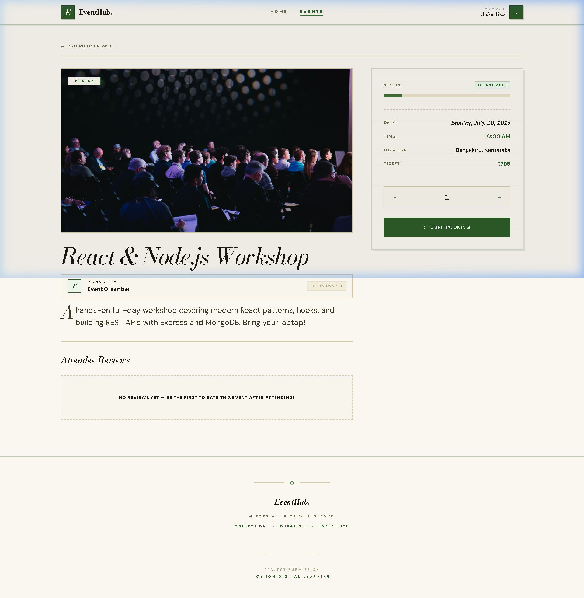
> Full event info — seats, price, organizer link, booking CTA, and community reviews with star ratings.

---

### 👤 User Role

| User Dashboard | My Bookings |
|:---:|:---:|
| 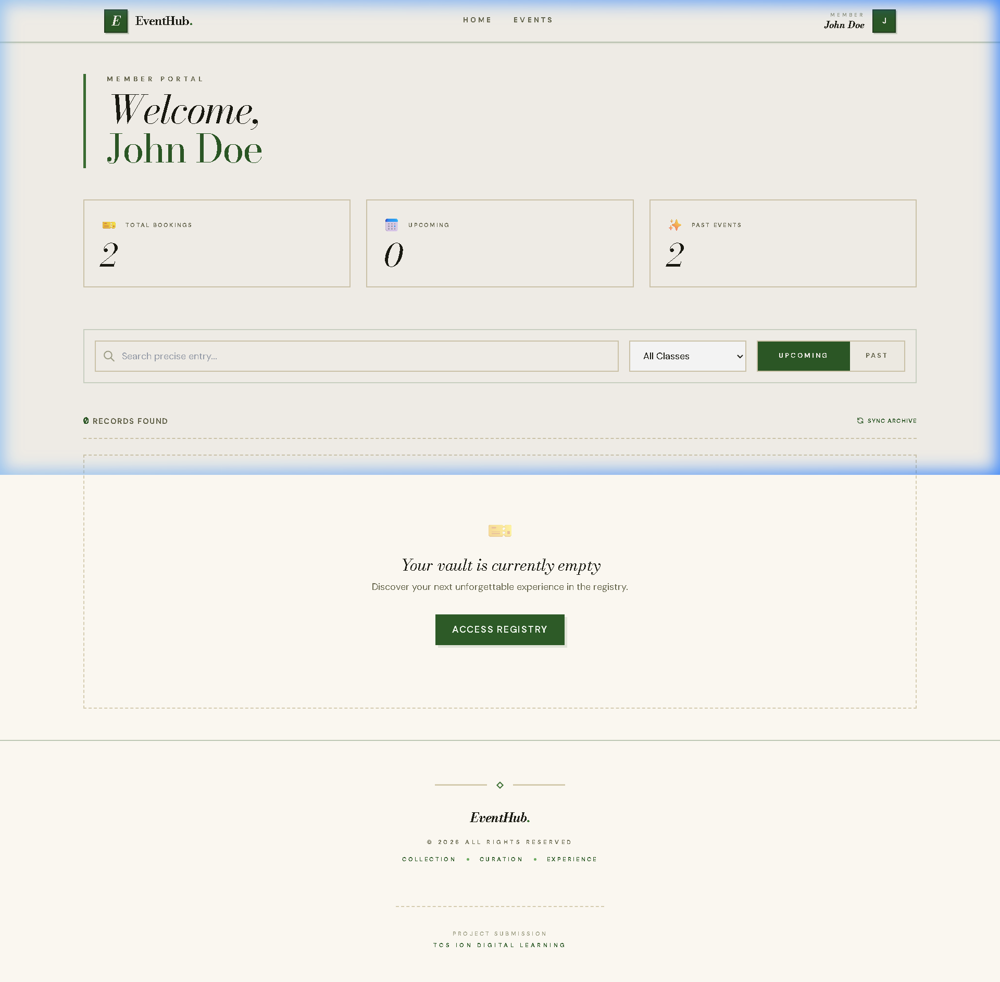 | 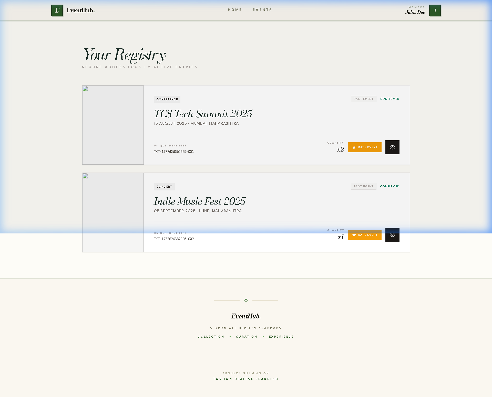 |
| Upcoming bookings & quick actions | Booking list with ticket IDs & cancel option |

**Booking Detail — Digital Ticket**
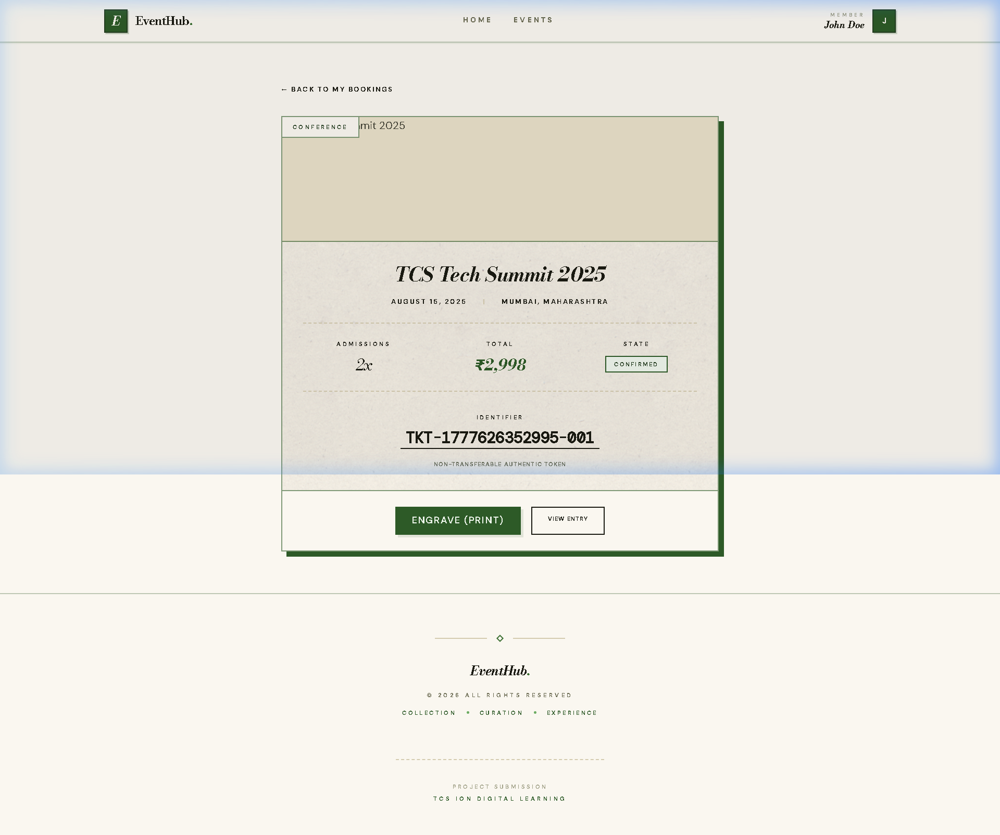
> Digital ticket card: event name, date, admissions count, total price, unique `TKT-*` identifier (DM Mono font), and ENGRAVE (Print) action.

**Profile & Account Settings**
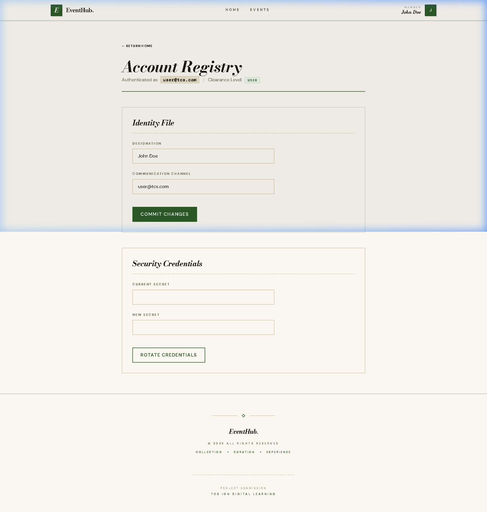

---

### 🗂️ Organizer Role

| Organizer Dashboard | Create Event |
|:---:|:---:|
| 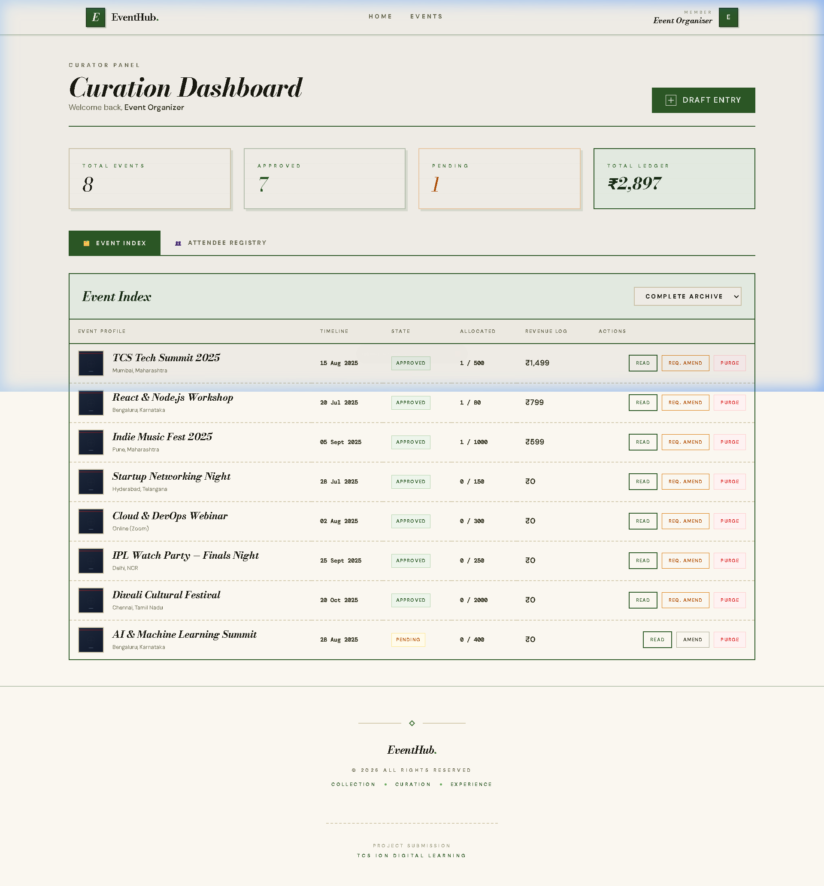 | 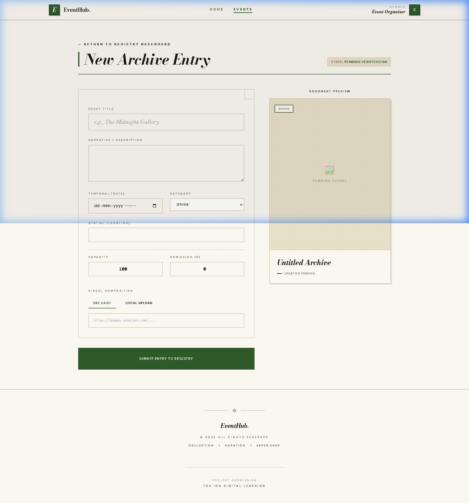 |
| Event stats, occupancy, revenue & attendee view | Dual-mode image upload (URL or file), full form |

---

### 👑 Admin Role

**Admin Dashboard — Analytics & KPIs**
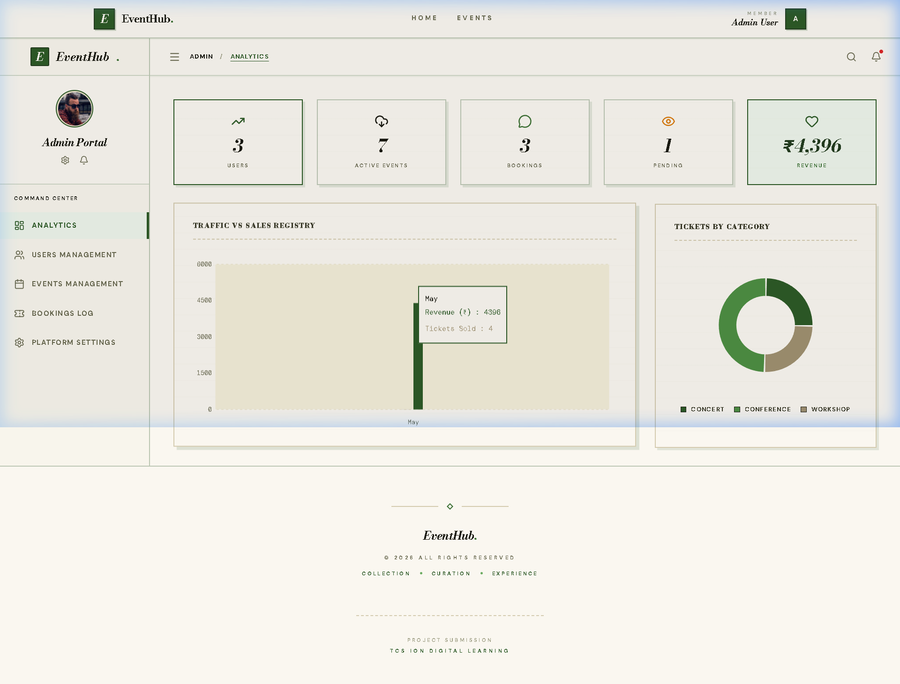
> Real-time KPI cards, Recharts line chart (Monthly Traffic vs Sales) & pie chart (Bookings by Category).

**Admin User Management**
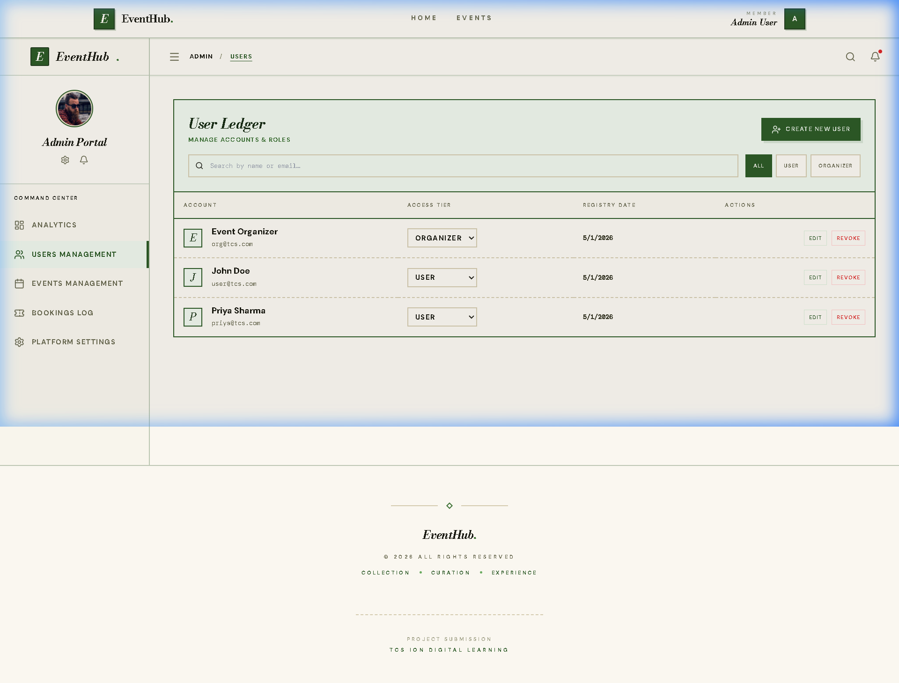
> Full user management: create, edit role, delete with cascade. Also covers event approval and booking oversight.

---

## 🧑‍💻 Author

**Amarnath T V**
- 🐙 GitHub: [@am6nath](https://github.com/am6nath)
- 🎓 TCS iON Internship Project · April 2026
- 🛠️ Built with the MERN Stack

---

## 📄 License

This project is licensed under the **MIT License** — see the [LICENSE](./LICENSE) file for full details.

```
Copyright (c) 2026 Amarnath T V (github.com/am6nath)
```

You are free to use, copy, modify, and distribute this software with proper attribution.

---

*This project was developed as part of the TCS iON internship programme. The codebase demonstrates full-stack engineering capabilities including REST API design, JWT security, MongoDB data modelling, React component architecture, and production-grade UI/UX.*

